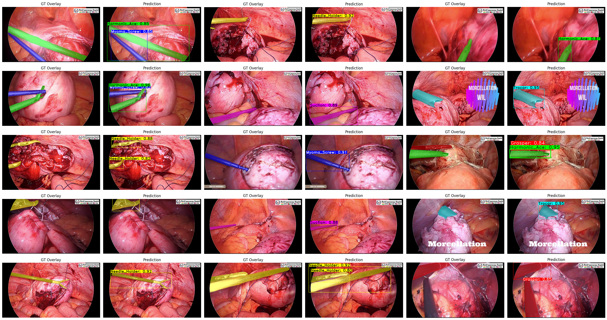

# Multi-SIS-Instance-Segmentation-by-YOLACT++

This repository contains code and results for **instance segmentation** of surgical instruments using **YOLACT++ (ResNet-50)** on a custom dataset.

## 🗂 Dataset

- **Format:** COCO-style (JSON)
- **Classes (6):**
  - Grasper
  - Harmonic_Ace
  - Myoma_Screw
  - Needle_Holder
  - Suction
  - Trocar
- **Folders:**
  - `images/train/`, `images/valid/`
  - `annotations/instances_train.json`, `instances_valid.json`

## 🏗 Model & Training

- **Model:** `YOLACT++`
- **Backbone:** resnet50_dcnv2_backbone
- **Epochs:** 20
- **Framework:** PyTorch
- **Score Threshold:** 0.5
- **top_k:** 10

### 💡 Evaluation

**Segmentation (segm):**
- mAP@[0.50:0.95]: `67.8%` 
- AP50: `82.7%` 
- Best class: `Harmonic_Ace` (0.9057 F1)
- Worst class: `Suction` (0.6816 F1)
- Average P,R,F1: `0.8275,  0.8500,  0.8385`          

## 🔍 Inference

To run inference and visualize N random samples from validation set:

```python
visualize_inference_grid(n_images=15)
```

- Colors are fixed per class
- Results shown in 6-column grid
- GT Overlay Vs. Prediction

📌 Example:



## 📦 Files

- `.ipynb` – Step by step codes
- `.png` – Example results
- `README.md` – You are here

## ⚙ Dependencies

- Python 3.11
- PyTorch
- DCNv2

## 📜 License

This project is released for research purposes only. Please cite appropriately if used in publications.
